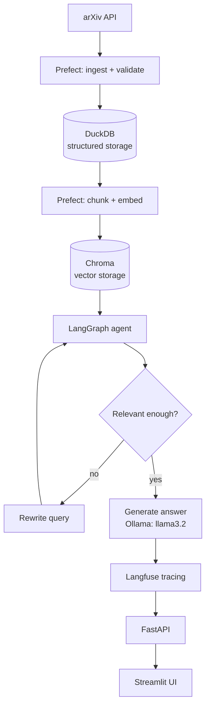

# RL Research Agent — Agentic AI Data Pipeline

A fully local, zero-cost, end-to-end agentic AI system that ingests recent reinforcement learning papers from arXiv, embeds them for semantic search, and answers natural-language questions through a self-correcting retrieval-augmented (RAG) agent — with full observability and CI.

Built to demonstrate production-grade data engineering and MLOps patterns (orchestration, idempotent storage, schema validation, retries, corrective retrieval, tracing, CI) at senior data engineer / ML engineer scope, without relying on any paid cloud services.

## What it does

Ask a question like *"What are recent approaches to reward shaping in RL?"* and the agent:

1. Retrieves the most relevant paper excerpts from a locally stored vector index
2. **Grades its own retrieval** — if the results aren't actually relevant, it rewrites the search query and tries again (up to 2 attempts)
3. Generates a grounded answer using a local LLM, citing only the retrieved papers, never fabricating details
4. Returns the answer with source links, traceable end-to-end in an observability dashboard

## Architecture



**Pipeline stages:**

| Stage | Tool | Purpose |
|---|---|---|
| Ingestion | Prefect | Scheduled, retryable fetch from arXiv's public API |
| Structured storage | DuckDB | Idempotent storage of paper metadata, analytical queries |
| Vector storage | Chroma | Semantic search over chunked paper abstracts |
| Embedding model | Ollama — `nomic-embed-text` | Converts text into vectors for similarity search |
| Generation model | Ollama — `llama3.2` | Reasoning, grading retrieval quality, writing answers |
| Agent | LangGraph | Self-correcting RAG: retrieve → grade → rewrite (if needed) → generate |
| Observability | Langfuse (self-hosted) | Tracing every agent run: latency, retrieval quality, prompts |
| Serving | FastAPI + Streamlit | HTTP API and a usable web UI on top of it |
| CI | GitHub Actions | Lint + test on every push |

## Why two different Ollama models

`llama3.2` and `nomic-embed-text` do fundamentally different jobs and aren't interchangeable:

- **`nomic-embed-text`** is a specialized *embedding* model — it only converts text into vectors for similarity search. It cannot generate conversational text.
- **`llama3.2`** is a general-purpose *generation* model — it reasons, writes, and makes judgment calls (like grading whether retrieved context is relevant). It's not built to produce embeddings.

Using the right specialized model for each task, rather than forcing one model to do everything, mirrors how production systems are actually built.

## Why these tools (and what was rejected)

Every choice below was made for being **free, self-hostable, and representative of real production patterns** — not a toy substitute for the real thing.

- **Prefect over Airflow/Dagster** — lightweight, Pythonic, no separate scheduler/webserver needed to self-host for a solo project.
- **DuckDB over Postgres/SQLite** — zero-server, file-based, columnar/OLAP-oriented — behaves like a real analytical warehouse engine, not a toy database.
- **Chroma over Pinecone/Weaviate/pgvector** — runs embedded in-process, no server, account, or network dependency.
- **LangGraph over CrewAI/AutoGen** — the most industry-adopted framework for stateful, production-style agents, and keeps branching/looping logic explicit (used here for the corrective retrieval loop) rather than abstracting it away.
- **Ollama over paid LLM APIs** — free, unlimited local inference, demonstrates working with open-weight models instead of just calling a hosted API.
- **Langfuse over LangSmith** — open-source and self-hostable via Docker with no usage caps.
- **FastAPI + Streamlit over Flask/custom React** — FastAPI is async-native with auto-generated OpenAPI docs; Streamlit gets a working, presentable UI in minimal code.

## Production-grade practices baked in

- **Idempotency** — re-running ingestion or embedding never creates duplicates (`arxiv_id`-keyed inserts in DuckDB, a separate `embedded_papers` tracking table for Chroma)
- **Schema validation** — every ingested record is validated through a Pydantic model before being trusted; malformed records are skipped and logged, not silently corrupted
- **Retry logic** — arXiv API calls automatically retry on failure via Prefect's `@task(retries=3, retry_delay_seconds=10)`
- **Corrective retrieval** — the agent grades its own retrieval quality and rewrites the search query if the first attempt misses, capped at 2 attempts to avoid infinite loops
- **Anti-hallucination prompting** — the agent's prompt explicitly forbids inventing citation details (author names, years, IDs) not present in retrieved context — caught and fixed after an early version fabricated plausible-looking but false citations
- **Structured logging** — Prefect's logger throughout, not scattered print statements
- **Observability** — every agent run traced in Langfuse (latency, retrieved context, generated output, retrieval attempts)
- **CI** — lint and automated tests run on every push via GitHub Actions
- **Tests** — unit tests on the Pydantic schema covering valid records and rejection of malformed ones

## Running it locally

**Prerequisites:** Python 3.11+, Docker Desktop, Ollama

```bash
# 1. Clone and set up environment
git clone https://github.com/AmirSoyelAhmed-hub/agentic-research-pipeline.git
cd agentic-research-pipeline
python -m venv venv
venv\Scripts\activate          # Windows
pip install -r requirements.txt

# 2. Pull local models
ollama pull llama3.2
ollama pull nomic-embed-text

# 3. Start Langfuse (self-hosted, in a sibling folder)
cd ..
git clone https://github.com/langfuse/langfuse.git langfuse-server
cd langfuse-server
docker compose up -d
# Visit http://localhost:3000, sign up, create a project, generate API keys

# 4. Configure environment
cd ../agentic-research-pipeline
# Create a .env file with:
#   LANGFUSE_PUBLIC_KEY=...
#   LANGFUSE_SECRET_KEY=...
#   LANGFUSE_HOST=http://localhost:3000

# 5. Run the pipeline
python -m pipelines.arxiv_ingest      # fetch & store papers
python -m pipelines.embed_store       # chunk & embed into Chroma
python -m agents.research_agent       # test the agent directly

# 6. Run the app (two terminals)
uvicorn api.main:app --reload         # backend: http://127.0.0.1:8000/docs
streamlit run app.py                  # frontend: http://localhost:8501
```

## What I'd change for true production scale

This project is intentionally sized to run free on a laptop. At production scale, the natural evolution would be:

- **DuckDB → Postgres/Snowflake** for concurrent access and larger data volumes
- **Chroma → a managed vector DB** (Pinecone, Weaviate Cloud) for horizontal scaling
- **Ollama → hosted inference** for throughput and latency at scale
- **Prefect local → Prefect Cloud or Kubernetes-based deployment** for real scheduling, alerting, and multi-worker execution
- **Add data quality monitoring** (row count anomalies, freshness checks) beyond current schema-level validation
- **Add authentication and rate limiting** to the FastAPI layer before any public exposure

## Project structure

```
agentic-research-pipeline/
├── pipelines/
│   ├── models.py          # Pydantic Paper schema
│   ├── arxiv_ingest.py    # Prefect flow: fetch + validate
│   ├── storage.py         # Idempotent DuckDB inserts
│   └── embed_store.py     # Chunk, embed, store in Chroma
├── agents/
│   └── research_agent.py  # LangGraph corrective RAG agent with Langfuse tracing
├── api/
│   └── main.py             # FastAPI backend
├── app.py                  # Streamlit frontend
├── tests/
│   └── test_pipeline.py    # Schema validation tests
├── .github/workflows/
│   └── ci.yml               # Lint + test on push
└── requirements.txt
```
